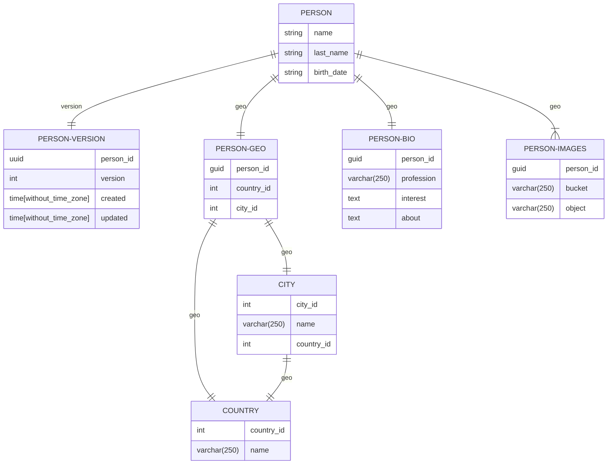
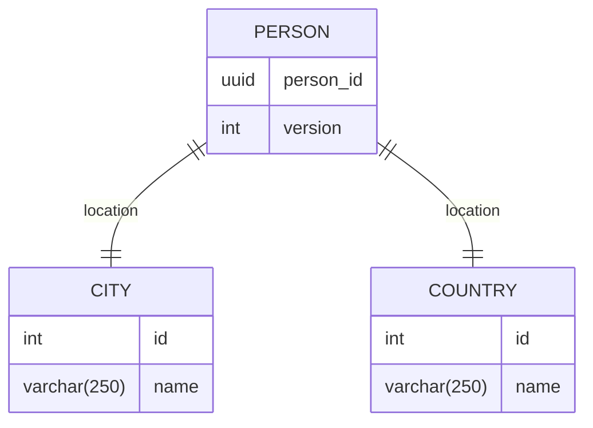

# PostgresSQL Shema

# NEO4J

# Идея номер 1 (V1)

Храним данные о пользователе внутри PostgreSQL
При записи добавляем +1 к версии
Также делаем синхронную реплику в only-write базу
Далее асинхронно дублируем данные уже в neo4J

Потенциальные проблемы:
Если хотим сразу же осуществить поиск по новым данным, которые еще не попали в neo4j - можно осуществить поиск в only-write инстансе PostgreSQL

# Идея номер 2 (V2)

Храним все данные пользователя внутри Neo4J, в PostgreSQL сохраняем только ту информацию, которая не связана с инфой о пользователе и не участвует в поиске, например чаты, метаинформация о файлах и т.д.

# Сравнение вариантов

1. В V2 нет дублирования информации
   1. Не требуется миграция данных, поиск доступен сразу после записи
2. Системы в V2 имеют разные БД под разные цели
3. Объем информации не будет сильно большой для БД, что не должно повлиять на нагрузку в Neo4j
4. Дополнительно можно отказаться от id в справочниках городов/стран, а напрямую использовать ноды из Neo4J
